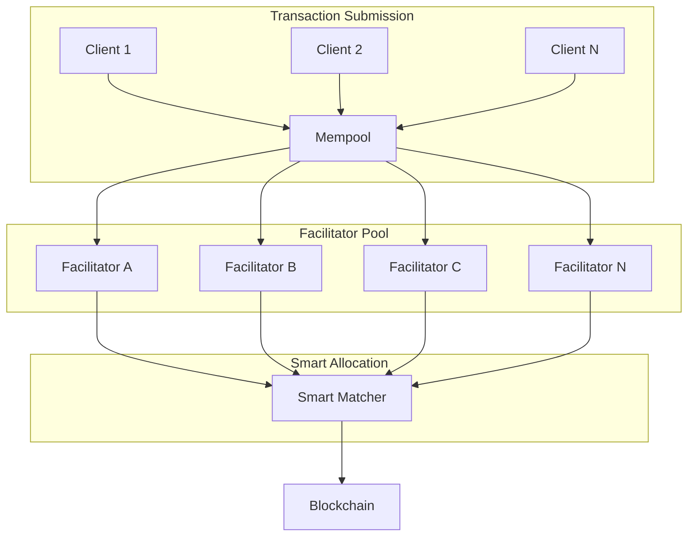

## Problem Background

In the standard X402 ecosystem, Facilitator load is severely imbalanced:

<Warning>
**Current Issues:**
- 90% of transactions concentrated in 3-5 top Facilitators
- Peak latency can reach 30+ seconds
- Long-tail Facilitator resources remain idle
- Lack of dynamic load distribution mechanisms
</Warning>

## Closetome Mempool Architecture

### Core Design



### Workflow

<Steps>
  <Step title="Transaction Pooling">
    All pending X402 transactions enter a unified public mempool
  </Step>
  <Step title="Competitive Matching">
    Facilitators compete to process transactions based on capacity and fee rates
  </Step>
  <Step title="Smart Allocation">
    System intelligently assigns transactions based on performance, fees, and success rate
  </Step>
  <Step title="Settlement Rewards">
    Facilitators earn fee rewards for successfully processed transactions
  </Step>
</Steps>

## Economic Model

### Staking Mechanism

Facilitators must stake tokens to participate in the network:

- **Staking Token**: $CLOSETOME tokens exclusively
- **Minimum Stake**: Required amount of $CLOSETOME tokens
- **Unstaking Period**: 7 days
- **Slashing**: Penalties for malicious behavior or poor performance

### Revenue Distribution

<Tabs>
  <Tab title="Base Revenue">
    ```
    Base Fee = Transaction Amount × Fee Rate

    Example: Processing 1 ETH transaction
    Fee Rate: 0.1%
    Base Revenue: 0.001 ETH
    ```
  </Tab>
  <Tab title="Performance Bonus">
    ```
    Performance Metrics:
    - Success Rate: 99%
    - Average Latency: 100ms
    - Uptime: 99.9%
    - Daily Volume: 1000 transactions

    Bonus Multiplier: 1.5x - 3x
    ```
  </Tab>
  <Tab title="Penalty Mechanism">
    ```
    Penalties:
    - Failed Transaction: 0.1% of stake
    - Double Signing: 10% of stake
    - Extended Offline: 5% of stake
    ```
  </Tab>
</Tabs>

## Smart Load Balancing

### Allocation Algorithm

The system selects optimal Facilitators based on performance factors only:

```
Score = (Fee Competitiveness × 40%) +
        (Performance Weight × 30%) +
        (Capacity Weight × 20%) +
        (Latency Weight × 10%)
```

<Note>
Staking amount does NOT affect allocation weight. All Facilitators meeting the minimum stake requirement compete equally based on performance metrics.
</Note>

### Dynamic Adjustment

- **Queue Monitoring**: Reduce allocation when queue grows
- **Success Rate Tracking**: Penalize low success rates
- **Latency Measurement**: Temporarily reduce weight for high latency
- **Capacity Management**: Balance load across available resources

## Implementation Concepts

### Becoming a Facilitator

<Note>
Facilitator node implementation is under development. The following describes the conceptual design.
</Note>

To participate as a Facilitator:

1. **Stake \$CLOSETOME**: Lock required $CLOSETOME tokens in the registry contract
2. **Run Infrastructure**: Operate reliable processing infrastructure
3. **Set Fee Rates**: Configure competitive fee structures
4. **Process Transactions**: Compete for and process transactions
5. **Earn Rewards**: Receive fees for successful processing

### Using the Mempool

As a user, you benefit from:

- **Automatic Routing**: Transactions routed to optimal Facilitators
- **Competitive Pricing**: Market-driven fee rates
- **High Reliability**: Decentralized redundancy
- **Transparent Operation**: Public visibility of all transactions

## Monitoring and Analytics

### Network Statistics

Track key network metrics:

- Active Facilitators count
- Total staked value
- 24-hour transaction volume
- Average fee rates
- Network success rate

### Performance Metrics

Monitor Facilitator performance:

- Transaction throughput
- Success rates
- Average latency
- Fee competitiveness
- Stake amounts

## Advantages Over Traditional X402

| Feature | Traditional X402 | Closetome Mempool |
|---------|-----------------|-------------------|
| **Load Distribution** | Concentrated in top nodes | Smart balanced allocation |
| **Fee Rates** | Fixed or monopolistic | Market-competitive pricing |
| **Reliability** | Single point of failure risk | Decentralized redundancy |
| **Scalability** | Limited by top node capacity | Horizontal infinite scaling |
| **Transparency** | Opaque selection | Public matching algorithm |

## Best Practices

<AccordionGroup>
  <Accordion title="For Facilitator Operators">
    - Maintain high availability (>99.9% uptime)
    - Optimize processing latency (less than 200ms)
    - Set reasonable fee rates (market average ±20%)
    - Keep software updated
    - Monitor key metrics and respond promptly
  </Accordion>

  <Accordion title="For Users">
    - Set reasonable timeout values
    - Implement retry mechanisms
    - Monitor transaction status
    - Understand fee structures
    - Use batch operations when possible
  </Accordion>

  <Accordion title="Security Considerations">
    - Verify Facilitator signatures
    - Check stake status
    - Avoid dependence on single Facilitators
    - Monitor abnormal transaction patterns
    - Implement rate limiting
  </Accordion>
</AccordionGroup>

## Future Development

### Planned Features

- **Cross-chain Support**: Process transactions across multiple blockchains
- **Advanced Routing**: ML-based optimal Facilitator selection
- **Fee Prediction**: Real-time fee estimation based on network conditions
- **Reputation System**: Long-term performance tracking and scoring

### Research Areas

- Zero-knowledge proof integration for privacy
- Layer 2 scaling solutions
- Quantum-resistant cryptography
- Advanced game theory for incentive optimization

## Summary

Closetome's decentralized Facilitator mempool achieves load balancing through market mechanisms, improving the efficiency and reliability of the entire X402 ecosystem.

<CardGroup cols={2}>
  <Card
    title="Atomic Transactions"
    icon="lock"
    href="/core/atomic-transactions"
  >
    Learn about transaction atomicity guarantees
  </Card>
  <Card
    title="GitHub Repository"
    icon="github"
    href="https://github.com/closetome-ai"
  >
    Follow development progress
  </Card>
</CardGroup>