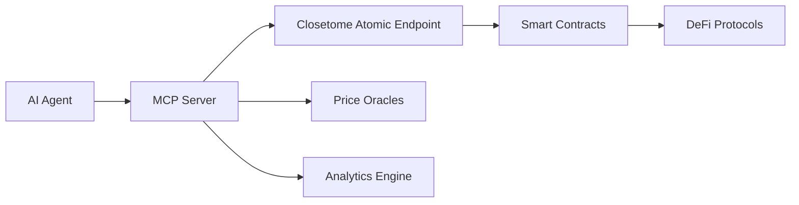

## Overview

Model Context Protocol (MCP) Server is a best practice implementation showcasing how to leverage Closetome's atomic X402 capabilities to build powerful AI Agent DeFi toolsets.

<Note>
MCP Server abstracts complex on-chain operations into simple function calls, allowing AI Agent developers to focus on business logic rather than infrastructure.
</Note>

## What is MCP?

Model Context Protocol is a standardized interface that allows AI models to interact with external systems and tools. Closetome's MCP Server extends this protocol specifically for DeFi operations.

## Use Case: DeFi Trading Bot

### Scenario

Build an AI Agent capable of autonomously executing trading strategies:

- Monitor market prices and execute arbitrage
- Automatically manage liquidity positions
- Optimize capital efficiency through smart lending
- Perform cross-chain asset allocation

### Conceptual Architecture

<Note>
The MCP Server implementation is currently under development. The following describes the planned architecture and capabilities.
</Note>



## Core Capabilities

### 1. Decentralized Exchange Operations

The MCP Server will provide seamless access to DEX functionality:

- **Token Swaps**: Execute trades across multiple DEXs
- **Liquidity Provision**: Add/remove liquidity atomically
- **Price Discovery**: Access real-time price feeds
- **Slippage Protection**: Automatic slippage calculation and limits

### 2. Lending Protocol Integration

Manage lending positions efficiently:

- **Supply Assets**: Lend tokens to earn yield
- **Borrow Assets**: Take loans against collateral
- **Position Management**: Monitor health factors and liquidation risks
- **Rate Optimization**: Find best lending rates across protocols

### 3. Yield Farming Strategies

Automate complex yield farming operations:

- **Stake Assets**: Deposit into staking protocols
- **Compound Rewards**: Auto-compound earned rewards
- **Strategy Optimization**: Maximize APY across opportunities
- **Risk Management**: Balance yield and risk exposure

### 4. Cross-Chain Operations

Bridge and manage assets across blockchains:

- **Asset Bridging**: Move tokens between chains
- **Cross-chain Swaps**: Trade across different blockchains
- **Multi-chain Portfolios**: Manage positions on multiple chains
- **Gas Optimization**: Choose optimal chains for operations

## Integration Concepts

### For AI Frameworks

The MCP Server will integrate with popular AI frameworks:

```python
# Conceptual Python integration
from closetome import MCPServer

mcp = MCPServer()

# AI Agent can call DeFi functions naturally
async def execute_strategy(market_data):
    if market_data.arbitrage_opportunity > 0.01:
        result = await mcp.swap(
            from_token="ETH",
            to_token="USDC",
            amount=1.0,
            atomic=True  # Ensures atomicity with payment
        )
    return result
```

### For LangChain

Integration with LangChain for conversational AI:

```python
# Conceptual LangChain tool
from langchain.tools import Tool
from closetome import MCPTools

tools = [
    Tool(
        name="DeFi Swap",
        func=MCPTools.swap,
        description="Swap tokens on decentralized exchanges"
    ),
    Tool(
        name="Check Balance",
        func=MCPTools.get_balance,
        description="Check token balances across protocols"
    )
]
```

## Atomic Execution Benefits

### Traditional Approach Problems

Without atomicity, AI Agents face risks:

1. **Partial Execution**: Swap succeeds but fee payment fails
2. **Race Conditions**: Market moves between operations
3. **Complex Error Handling**: Need compensation logic
4. **Capital Inefficiency**: Funds locked in failed operations

### Closetome Solution

With atomic X402 integration:

1. **All-or-Nothing**: Operations and payments execute together
2. **Consistency Guaranteed**: No partial states possible
3. **Simplified Logic**: No compensation needed
4. **Capital Efficient**: Funds never stuck in limbo

## Security Features

### Risk Management

Built-in safety mechanisms:

- **Slippage Protection**: Maximum acceptable price impact
- **Gas Limits**: Prevent excessive transaction costs
- **Timeout Protection**: Cancel stale transactions
- **Whitelist Contracts**: Only interact with verified protocols

### Economic Security

Protection against manipulation:

- **MEV Protection**: Prevent sandwich attacks
- **Oracle Verification**: Cross-check price feeds
- **Circuit Breakers**: Emergency pause mechanisms
- **Rate Limiting**: Prevent spam and DoS

## Performance Optimization

### Caching Strategy

Reduce latency and costs:

- **Price Caching**: Recent price data cached locally
- **Gas Estimation**: Pre-calculate gas requirements
- **Route Optimization**: Cache optimal swap paths
- **State Management**: Efficient position tracking

### Batch Operations

Process multiple operations efficiently:

- **Batch Swaps**: Execute multiple trades in one transaction
- **Compound Actions**: Combine harvest and reinvest
- **Portfolio Rebalancing**: Adjust multiple positions atomically
- **Cross-protocol Operations**: Interact with multiple protocols together

## Conclusion

Closetome MCP Server represents the future of AI-powered DeFi interactions, providing a secure, efficient, and developer-friendly way to build autonomous financial agents.

<CardGroup cols={2}>
  <Card
    title="GitHub Repository"
    icon="github"
    href="https://github.com/closetome-ai"
  >
    Follow development progress
  </Card>
</CardGroup>